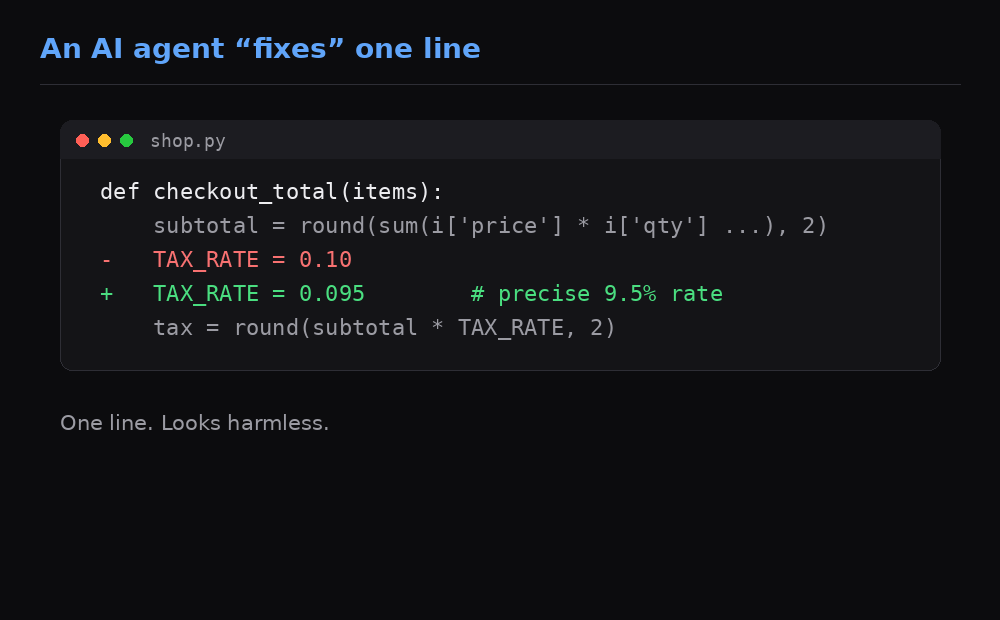
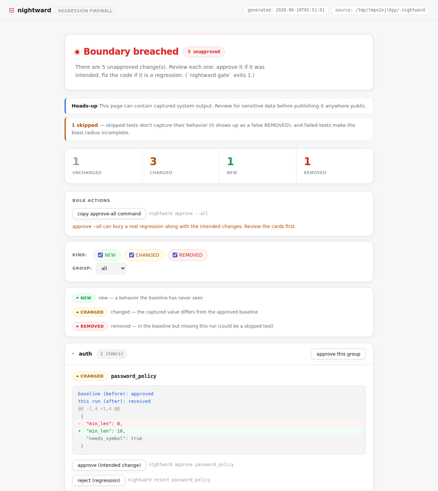

# nightward

**Stop the exhausting infinite fix-loop.** *Gate every AI-made change against an approved behavior boundary.*



When an AI agent fixes A, it quietly moves B, C, and D. You discover the side
effects later, fix those, and spawn three more. nightward makes that blast radius
**visible immediately** and **blocks** anything that crosses an approved boundary —
so an autonomous loop finally has a definition of "done."

It is **not** a test generator. It captures what your system *already does*,
you approve it once, and from then on every change is gated against that snapshot.

## How it differs

| | |
|---|---|
| vs. NL→test generators | nightward **gates** changes, it doesn't author tests |
| vs. plain snapshot libs | nightward aggregates a **blast radius** + emits a machine **stop-signal** for agent loops |
| vs. ordinary regression tests | nightward judges AI/non-deterministic output and bounds the cascade |

## Quickstart

```bash
pip install -e .

# 1. capture current behavior and approve it as the baseline
nightward run example
nightward approve --all

# 2. change the code, then re-run — the blast radius shows what moved
nightward run example
nightward review

# 3. gate it (exit 1 on any unapproved change) — wire this into CI / a ralph loop
nightward gate
nightward status --json     # {"boundary": "breached", "unapproved": 1, ...}

# 4. see the blast radius in a browser (read-only dashboard)
nightward view              # builds a static site + serves it on localhost
```

## Workflow

```
nightward run     re-run tests → capture → compute blast radius
nightward review  show changed behaviors with diffs
nightward doctor  name the volatile fields behind CHANGED behaviors, suggest scrub rules
nightward approve promote pending behavior(s) into the baseline
nightward reject  confirm a change as a real regression (boundary stays breached)
nightward gate    exit 0/1 for CI and agent loops
nightward status  machine-readable boundary signal (--json)
nightward view    build a static, read-only dashboard and view it in a browser
```

## Semantic judge (v0.2) — gate nondeterministic AI text

Free-text AI output breaches the fingerprint gate on every rewording (measured:
25/25 false positives on real data). Mark such behaviors `semantic=True` and pick
a judge model per run — the judge rules **equivalence only**; approval stays human:

```python
def test_summary(behavior):
    behavior("daily_summary", summarize(items), group="ai", semantic=True)
```

```bash
nightward run . --judge anthropic:claude-haiku-4-5   # real LLM (pip install nightward[judge])
nightward run . --judge persona:editor               # deterministic, key-free stand-in
NIGHTWARD_JUDGE=anthropic:claude-haiku-4-5 nightward run .   # or via env
```

Any provider:model can plug in as a backend. Each ruling is recorded once per
fingerprint pair in `.nightward/judge_verdicts.json` — a **committed ledger**, so
the judge's own nondeterminism can't wobble the gate, fresh clones and CI replay
verdicts deterministically without a key, and every ruling lands in the PR diff
for human review. Judge failures fall back to the exact comparison (the gate
fails closed), and rulings are also surfaced in the CLI, `status --json`, and
the dashboard.

## Dashboard (`nightward view`)



`nightward view` renders the blast radius as a self-contained static site — boundary
status, counts, and grouped diffs with copy-paste `approve`/`reject` commands. It is
**read-only** (decisions stay in the CLI) and **static** (no backend), so it also
deploys to GitHub Pages. Data is loaded via `fetch('./data.json')` and rendered with
`textContent` only — captured output never touches an HTML parser.

> ⚠️ The dashboard embeds your captured behaviors. **Do not publish a real `.nightward/`
> store to a public site.** The Pages workflow only publishes synthetic clean-room data
> (`scripts/build_demo.py`).

## Threat model — what this gate does and does not protect against

Be precise about the guarantee: **"boundary intact" means no *captured* behavior
changed** — nothing more. Read these three limits before trusting the green light:

1. **Coverage is your instrumentation.** The gate only sees what `behavior()`
   calls capture. An agent can break an uncaptured code path and the boundary
   stays intact. Instrument the behaviors you actually care about, and treat
   the gate as a tripwire on those — not as proof that "nothing broke."
2. **The gate is a convention, not a sandbox.** An agent with shell access can
   run `nightward approve`, copy `pending/` into `baseline/`, delete `behavior()`
   calls, or add scrub rules that mask a change. nightward does not try to
   police the filesystem — instead, every one of those bypasses leaves a
   visible trace in git. The enforcement point is **review**:
   - `baseline/*.approved.json`, `judge_verdicts.json`, scrub rules, and test
     files are code — review their diffs in every PR;
   - protect your main branch (required human review) and let CI re-run
     `nightward run && nightward gate` from source, so a locally forged
     "intact" can't merge itself;
   - never wire `approve` into the agent loop or CI (the MCP server
     deliberately doesn't expose it — keep your own glue to the same rule).
3. **A semantic judge can be wrong.** A false-SAME verdict is a hole in the
   gate. That's why judging is opt-in per behavior, the prompt is conservative
   (unsure → DIFFERENT), failures fall back to exact comparison, and every
   ruling is recorded in the committed `judge_verdicts.json` for human review.
   If a behavior must never be judged leniently, don't mark it `semantic=True`.

## Document & artifact inputs (`nightward.adapters`)

The gate only ever sees JSON, so any file format is one adapter away. Two levels:
`from_file` fingerprints the raw bytes of *anything* (zero dependencies — works
for formats nobody has a parser for), while content adapters extract what matters
so byte-level noise (re-saves, metadata stamps) doesn't breach the gate:

```python
from nightward.adapters import from_file, from_pdf, from_xlsx, from_text

def test_monthly_artifacts(behavior):
    behavior("report.content", from_pdf("out/report.pdf"), group="report")
    behavior("report.artifact", from_file("out/report.pdf"), group="report")
    behavior("export", from_xlsx("out/export.xlsx"), group="data")
    behavior("notice", from_text("out/notice.txt"), group="data")  # utf-8/cp949 auto
```

`from_pdf` / `from_docx` / `from_xlsx` need `pip install "nightward[docs]"`.
Validated on real-world files (Korean PDF/XLSX/DOCX/HWP/legacy-encoded TXT):
see `docs/experiments/2026-06-10-document-input-adapters.md`.

## v0 scope (intentionally small)

In: pytest capture, blast-radius diff, gate, loop signal, field-aware scrub + doctor,
static dashboard, LLM-as-judge semantic diff (v0.2, multi-model).
Out (v1): PR-comment summaries, call-graph grouping, multi-language.
